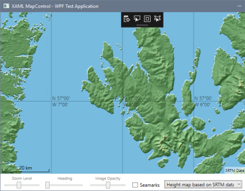

# Map with SRTM elevation data

Based on [Clemens Fischer](https://github.com/ClemensFischer)'s [XAML Map Control](https://github.com/ClemensFischer/XAML-Map-Control), 
this demo app shows how to add a map layer that renders custom tiles.
These custom tiles are based on [SRTM 90m Digital Elevation Data](https://cgiarcsi.community/data/srtm-90m-digital-elevation-database-v4-1/).

## Run the application

1. Download SRTM data (in file format *ArcInfo ASCII*) from http://srtm.csi.cgiar.org/SELECTION/inputCoord.asp, e.g. [srtm_35_01.zip](http://srtm.csi.cgiar.org/SRT-ZIP/SRTM_v41/SRTM_Data_ArcASCII/srtm_35_01.zip) for West Scotland (latitude 55 N - 60 N, longitude 10 W - 5 W)

2. Unzip the .asc file (e.g. srtm_35_01.asc) to any directory

3. Specify this directory in [TileImageLoader.cs](SrtmMapLayer.WPF/TileImageLoader.cs) as the *dataDirectory* parameter for the HeightMapProvider, e.g.

        private readonly HeightMapProvider srtmTileProvider = new HeightMapProvider("E:\\Temp");

4. Build the SampleApps/WpfApplication project and start it

5. In the map control, navigate to an area covered by the data downloaded in step 1., e.g. the Isle of Skye

   

6. Select "Height map based on SRTM data" as the layer to be displayed

   

7. Wait a moment for the data to load

   

8. Understand the bugs/limitations listed below

## Adding a custom map tile layer to the XAML Map Control

To create a custom map tile layer:

* Add a new class derived from MapTileLayer with a custom TileImageLoader

        public class MapLayer : MapTileLayer
        {
            public MapLayer()
                : base(new TileImageLoader())
            {
                SourceName   = "SRTM Tiles";
                Description  = "SRTM Data";
                MinZoomLevel = 8;
                MaxZoomLevel = 18;

                // dummy to satisfy condition in MapTileLayer.UpdateTiles()
                TileSource = new TileSource();
            }
        }

* In the [TileImageLoader](SrtmMapLayer.WPF/TileImageLoader.cs), implement ITileImageLoader.LoadTilesAsync()

Actual rendering happens in [Renderer.cs](Srtm/Renderer.cs) where the [elevation data](https://en.wikipedia.org/wiki/Digital_elevation_model)
is read from the [corresponding SRTM data tile](http://srtm.csi.cgiar.org/SELECTION/inputCoord.asp) and converted to a relief map.

## Known issues/bugs

This is more of a proof-of-concept for integrating other data sources with the XAML Map Control than a usable project and is not complete. 

Known problems/issues/limitations include:

* SRTM data tiles are expected to be saved to directory E:\Temp (set in [TileImageLoader.cs](SrtmMapLayer.WPF/TileImageLoader.cs))
* missing SRTM data tiles are not downloaded automatically, only those already in the download directory are used 
* only map tiles that are within one SRTM data tile are rendered (in other words, those spanning two or more SRTM data tiles are not rendered)
* the calculation of coordinates based on the map tile to be displayed is incorrect
* This only works for the WPF application, the UWP code has not been updated
* ...